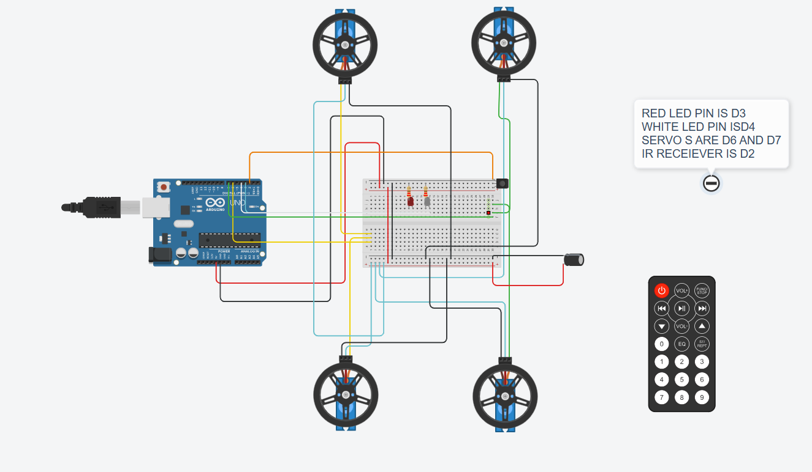
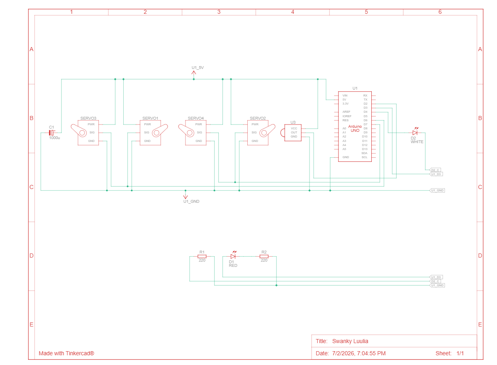

# 🚗 Arduino IR Linear Rover

A simple Arduino-powered rover controlled using an IR remote.

This project uses two continuous rotation servos to achieve linear motion (forward, reverse and stop) while LEDs indicate the direction of movement.

---

## ✨ Features

- 📡 IR Remote Control
- 🚗 Forward Motion
- 🔙 Reverse Motion
- ⏹️ Stop Function
- 💡 LED Direction Indicators
- 🔄 State-Based Motion Control

---

## 🛠️ Components Used

- Arduino Uno
- IR Receiver Module
- IR Remote
- 4× Continuous Rotation Servos
- Red LED
- White LED
- Breadboard
- Jumper Wires

## 🔌 Pin Configuration

| Component | Arduino Pin |
|-----------|-------------|
| IR Receiver | D2 |
| Red LED | D3 |
| White LED | D4 |
| Front Servo | D6 |
| Rear Servo | D7 |

---

## 🎮 Remote Functions

| Button | Action |
|---------|--------|
| Front | Move Forward |
| Back | Move Reverse |
| Stop | Stop Rover |

---

## 📷 Project Images

### 🚗 Rover Simulation

---

### 🔌 Circuit Schematic

---

## 📚 What I Learned

- Continuous rotation servo control
- IR remote communication
- State-based programming
- Hardware debugging

## 🙏 Acknowledgements

The frontend visualization and portions of the code organization were improved with AI assistance during development. The hardware integration, testing, debugging and overall project implementation were completed as part of my learning process.

